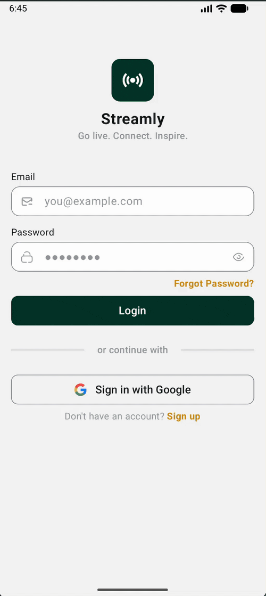
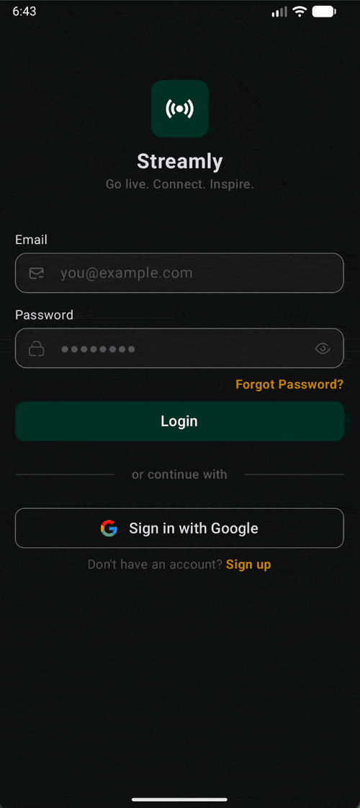
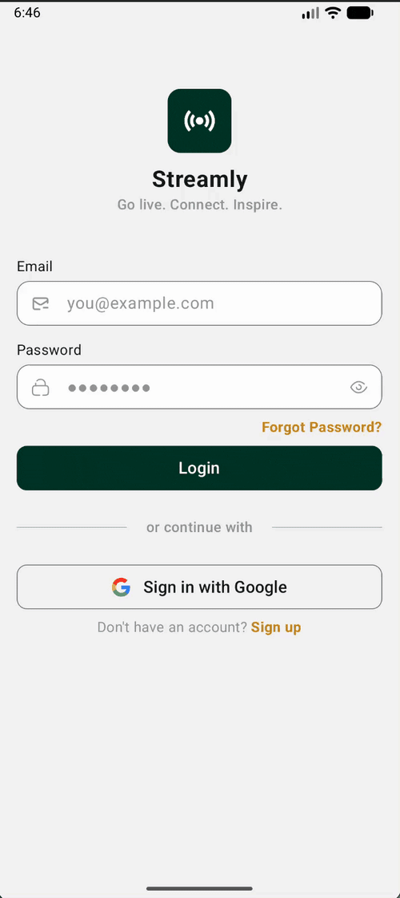
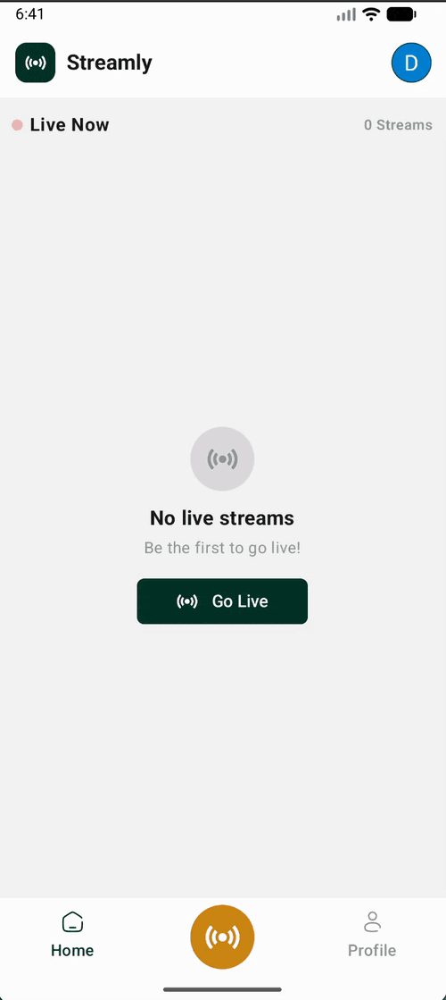

# Streamly


A live streaming Android app built with Jetpack Compose, Agora RTC, and Firebase. Hosts can broadcast in
real time; viewers can join, watch, and chat.

This is a personal project I built to push my own bar on what a production-shaped Android codebase should
look like: clean architecture, Compose-first UI, real-time data, and the kind of details I'd want a
teammate to find when they open a PR.

---

## Try the App

> **Download and install the APK directly on your Android device.**
> You may see an *"Install from unknown sources"* prompt, this is normal for APKs installed outside the Play Store.

[](https://github.com/khawajmoiz406/Streamly-Android/releases/download/v1.0.0/streamly.apk)

> **Minimum SDK:** Android 7.0 (API 24) &nbsp;|&nbsp; **Target SDK:** Android 14 (API 34)

---

## Full App Demo

> A complete walkthrough of hosting a live stream, viewer experience, real-time chat, PiP mode, and profile stats.

<video src="https://www.dropbox.com/s/YOURFILE/streamly_demo.mp4?raw=1" controls width="100%"></video>

> *If the video doesn't load inline, [click here to watch the demo](https://github.com/khawajmoiz406/Streamly-Android/releases/download/v1.0.0/live-stream-demo.mp4)*

---

## App Preview

<p align="center">
  
  &nbsp;&nbsp;
  
  &nbsp;&nbsp;
  

  
</p>

---

## Features

- **Sign in:** with email/password or Google (Credential Manager + Firebase Auth)
- **Go live:** start an Agora RTC broadcast, toggle on/off camera/mic, rotate camera, end the stream cleanly
- **Watch live:** join a stream as a viewer, send comments in real time, see the host's mute/camera state update live
- **PiP mode:** broadcaster and viewer both enter picture-in-picture by pressing home or back, keeping the stream alive while using other apps
- **Browse streams:** on a Home tab that observes Firestore for live status changes
- **Profile:** with lifetime stats (streams, total stream time, avg viewers) and a recent streams list, all driven by a Firestore snapshot listener so it updates the moment a new stream ends
- **Dark / light theme:** with persistent user preference, falls back to system theme if unset, custom Material 3 color scheme tokens

---

## Tech Stack

| Layer            | Tech                                                                           |
|------------------|--------------------------------------------------------------------------------|
| **UI**           | Jetpack Compose, Material 3, Coil (images + SVG)                               |
| **Architecture** | Clean Architecture, MVVM, Hilt (DI)                                            |
| **Async**        | Kotlin Coroutines & Flow                                                       |
| **Firebase**     | Firebase Firestore + Firebase Auth                                             |
| **Security**     | EncryptedSharedPreferences (AES-256)                                           |
| **Navigation**   | Type-safe Compose Navigation                                                   |
| **Auth**         | Firebase Auth + Google Identity (Credential Manager)                           |
| **RTC**          | Agora SDK                                                                      |
| **Media upload** | Cloudinary (profile photos)                                                    |
| **Background**   | Foreground Service keeps stream alive and handles app removal from recent apps |
| **PiP**          | Android PictureInPicture API with custom `RemoteAction` buttons                |

---

## Architecture

Clean Architecture (data → domain → presentation) with MVVM at the presentation layer.

```
com/livestreaming/streamly/
├── base/       , BaseViewModel<U, E>, SuspendUseCase / FlowUseCase contracts
├── config/     , theme, navigation, reusable components, utils
├── core/       , domain models, encrypted prefs, Firestore collections
└── ui/
    ├── auth/       , login / register, Google + email auth, profile photo upload
    ├── home/       , live streams list, real-time Firestore observer
    ├── broadcast/  , host a stream via Agora RTC, mic/camera controls
    ├── watch/      , join a stream as viewer, real-time chat
    ├── profile/    , lifetime stats, recent streams, sign-out
    ├── dashboard/  , bottom-nav hosting Home + Profile
    └── splash/     , landing / session
```

Every feature under `ui/` follows the same internal shape:

```
ui/<feature>/
├── data/
│   ├── local/       , encrypted prefs / cache
│   ├── remote/      , Firestore + Agora calls
│   └── repository/  , implements domain interface
├── domain/
│   ├── repository/  , interface
│   └── usecase/     , SuspendUseCase / FlowUseCase
├── presentation/
│   ├── <Feature>Screen.kt
│   ├── <Feature>ViewModel.kt  , extends BaseViewModel<UiState, Events>
│   ├── <Feature>UiState.kt
│   ├── <Feature>Events.kt     , one-shot events (errors, navigation)
│   └── component/             , composables
└── di/               , Hilt @Module per feature
```

The View observes a `MutableStateFlow<UiState>` and `MutableSharedFlow<Events>` exposed by the ViewModel.
ViewModels never reach into data sources, they call use cases (`SuspendUseCase<T, P>` returning
`Result<T>`, `FlowUseCase<T, P>` returning `Flow<T>`), which call repositories, which call local/remote
sources. One-way data flow, single source of truth per screen.

---

## Things I'd Point a Reviewer To

**Surgical list diffing:** the home screen doesn't replace the whole list on every Firestore update. It
diffs incoming changes against the current list and only touches what changed. One viewer count increment
doesn't recompose everything.

**Lifecycle-aware camera:** preview and channel join are split intentionally. You see yourself before
going live. `ON_STOP` is used instead of `ON_PAUSE` to stop the preview so it doesn't fire during PiP
transitions, no flags needed.

**Atomic viewer presence:** joining increments the viewer count and writes the viewer document in a
single Firestore batch. One network call, one listener trigger, always in sync.

**Ghost viewer cleanup:** `onTaskRemoved` in the foreground service handles app kills using
`NonCancellable` context.

**PiP with custom controls:** `RemoteAction` buttons for mic, camera, end/leave. Icons update live via
`setPictureInPictureParams`. A `BroadcastReceiver` routes taps back to the ViewModel through a
`SharedFlow` event bus, no direct Activity reference required.

**Comments as a derived flow:** `flatMapLatest` + `distinctUntilChanged` on stream ID means the Firestore
listener only restarts if you switch streams, not on every field update.

**Custom `NavType<T>`:** in `config/utils/extension/AppExtension.kt` for type-safe,
kotlinx.serialization-backed navigation arguments.

**Per-feature Hilt modules:** scoped to `ViewModelComponent`, feature dependencies live and die with the screen.

**Reusable composables:** in `config/components/` (buttons, switches, dialogs, snackbars), every screen
uses the same primitives.

**Responsive scaling:** with `sdp`/`ssp` so layouts hold up across screen sizes.

**Typed error model:** `sealed class ApiException` (`NetworkException`, `UnknownException`) wraps every
data-source failure with a context-resolved message. ViewModels surface it through `Events.OnError`,
screens render it via the global `SnackbarUtils` (typed Success/Error/Warning visuals).

**Form validation:** `GenericValidators` + per-field `FieldState(value, error)` pattern across
login/register; `PhoneNumberVisualTransformation` backed by libphonenumber for live phone formatting.

**Runtime permissions:** `PermissionUtils` driving the camera/mic flow on the broadcast screen with
denied-once and permanently-denied states handled separately.

---

## Running Locally

1. Clone the repo and open in Android Studio
2. Drop your own `google-services.json` into `/app`
3. Add your Cloudinary keys to `local.properties`
4. Add your Agora App ID to `Constants.kt` (optional, app runs without it but streaming won't work)
5. Sync Gradle and hit Run

---

## Honest Scope Notes

No test suite yet, that's the next thing I'd add. No CI or ProGuard rules yet. Both are on the roadmap.

---

## Contact

Built by **Khawaja Moiz**, Senior Android Engineer with 6 years of production experience.

📧 khwajamoiz406@gmail.com &nbsp;|&nbsp; [GitHub](https://github.com/khawajmoiz406) &nbsp;|&nbsp; [LinkedIn](https://www.linkedin.com/in/khawaja-moiz-71b6b1134)

---

## License

MIT, see [LICENSE](LICENSE) for details.